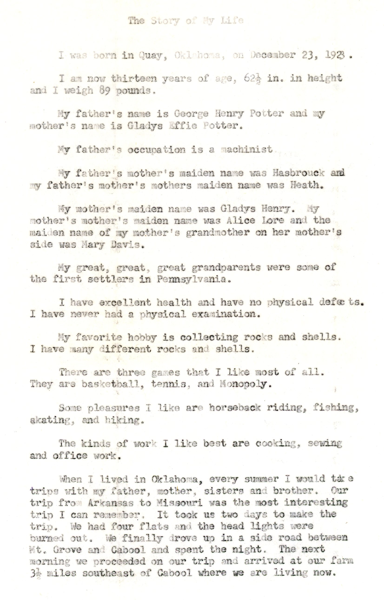

This is not exactly a letter, but rather the autobiography of Marjorie Potter (1923-2010) at age 13, probably a homework assignment from the Cabool, Missouri schools. Since her birthday was late in 1923, this was most likely written in 1937.  If it proves hard to read, there is a typed  version at the bottom of this page.  Marjorie's story of the family move from Barryville, Arkansas to Cabool is great...a two day trip to cover less than 150 miles, plus an impromptu camp-out within a few miles of their destination.  Lost, in the  dark, without headlightss.

And a typed transcription, possibly by Marjorie's sister Mary.

